# Auto QA

> 사내 QA 자동화 데스크톱 툴 (Electron). 프로젝트 폴더를 연결하면 **요구사항 → 체크리스트 → 테스트 생성 → 결정적 실행 → 품질 검증 → 추적성**까지 QA 전 과정을 안내한다. 주 대상은 Next.js 웹앱.

---

## 설계 원칙 — "AI 는 만들고, 기계가 판정한다"

이 툴의 뼈대는 하나다:

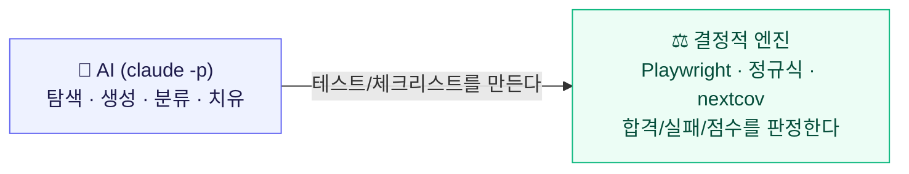

AI 한테 "이거 통과야?"를 매번 물으면 **비싸고 답이 들쭉날쭉**하다. 그래서 **AI 는 "무엇을 테스트할지" 만드는 데만** 쓰고, **"그게 진짜 맞는지 판정·측정"은 전부 기계(결정적)**가 한다. 이 경계가 툴 전체를 관통한다.

### AI 쓰는 것 vs 안 쓰는 것

| 🤖 AI 사용 (생성·판단) | ⚖️ AI 없음 (결정적 판정·측정) |
|---|---|
| 요구사항 분해 | 테스트 실행 (Playwright) |
| 체크리스트 생성 | **코드 커버리지** (nextcov / V8) |
| 테스트 코드 생성 | **단언 강도 분석** (정적 정규식) |
| self-healing (드리프트 vs 진짜버그 **분류**) | **셀렉터 검증** (인덱스 대조) |
| 구현 감사 / 요구사항 테스트 커버리지 | **네거티브 컨트롤** (기대값 변형) |
| | **mutation score** (소스 변형) |
| | **flaky 감지** (반복 실행) |
| | **추적성** (파일/항목 조인) |
| | 생성 채점 (단언강도 기반 점수) |

---

## 한눈에 보는 전체 과정

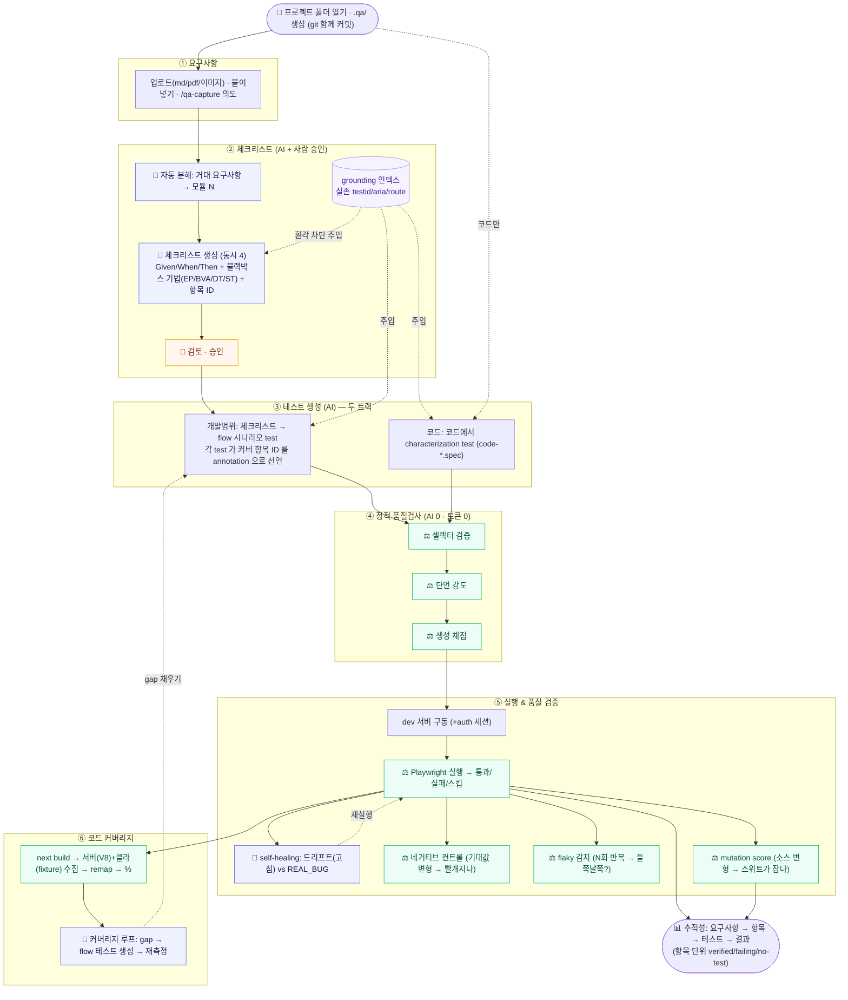

**되돌아가는 화살표 2개가 핵심 루프**다 — ① 실패 → self-healing → 재실행, ② 커버리지 gap → 테스트 생성 복귀.

---

# 기능 상세 (내부 동작)

## 1. 요구사항 입력

문서 업로드(md/txt/pdf/이미지), 직접 붙여넣기, 또는 `/qa-capture` 스킬로 개발 중 캡처한 "의도 원장". 이미지(가이드 화면)면 AI 가 화면을 보고 요구사항을 파악한다. → `.qa/requirements/`, `.qa/intent/`

## 2. 체크리스트 생성 — 🤖 AI

**무엇을:** 요구사항을 Given/When/Then 합격기준으로 분해한다. 거대 요구사항은 먼저 '모듈'로 쪼갠 뒤 모듈마다 체크리스트를 만든다.

### 요구사항 → 모듈 → 체크리스트 → 테스트 (fan-out)

```mermaid
flowchart TD
    REQ["요구사항 1개 (+ 프로젝트 코드)"] --> D["🤖 분해 decompose<br/>요구사항 + 코드(라우트·API)를 읽고<br/>'독립적으로 테스트 가능한 기능 모듈'로 분해"]
    D --> J[("modules.json<br/>[{id, title, summary}] × N")]
    J --> M1["모듈: 이름 검증"]
    J --> M2["모듈: 연락처 검증"]
    J --> M3["모듈: 레이트리밋 …"]
    M1 --> C1["🤖 체크리스트 1 (집중 모듈)<br/>GWT + [EP/BVA/DT/ST] + 항목 ID"]
    M2 --> C2["🤖 체크리스트 2"]
    M3 --> C3["🤖 체크리스트 N"]
    C1 --> T1["🤖 spec 1 (flow 시나리오 + 항목ID annotation)"]
    C2 --> T2["🤖 spec 2"]
    C3 --> T3["🤖 spec N"]
    classDef ai fill:#eef2ff,stroke:#6366f1,color:#1e1b4b
    classDef data fill:#f5f3ff,stroke:#a78bfa,color:#4c1d95
    class D,C1,C2,C3,T1,T2,T3 ai
    class J data
```

- **분해(decompose)**: AI 가 요구사항 + 실제 코드를 읽고 기능 단위로 `modules.json`(`[{id,title,summary}]`)을 씀. 잘게 쪼갤수록 좋음(게시판 종류마다·관리자→유저 반영 플로우마다·폼/검색/SEO 각각). 분해 결과 ≤1 이면 쪼개지 않고 단일 체크리스트로 폴백.
- **모듈마다 체크리스트**(②, 동시 4개): 각 모듈을 '집중 모듈'로 프롬프트에 넣어 그 모듈만의 GWT 를 작성.
- **체크리스트마다 테스트**(③, 동시 6개): 아래 3번. → 모듈이 병렬화·파일분리·추적성의 단위.
- ⚠️ 분해 경계는 **AI 판단**(콜그래프 아님)이라 재생성 시 모듈 구성이 달라질 수 있음.

**내부 동작:**
- AI 가 요구사항 + 프로젝트 코드를 Read/Grep 하고, **grounding 인덱스**(실존 testid/aria/route)를 주입받아 근거 기반으로 항목 작성.
- **블랙박스 설계기법을 명시 주입** → 해피패스 편중을 막고 입력 공간을 빠짐없이 도출, 각 항목에 기법 태그를 붙인다:
  - `[EP]` 동등분할 · `[BVA]` 경계값 · `[DT]` 결정표 · `[ST]` 상태전이
- 각 항목은 위치 기반 **항목 ID**(`<checklist>-01`…)로 구조화된다 → 이후 테스트가 이 ID 를 참조.

> 프론티어 모델에선 블랙박스 주입의 완전성 순증은 작지만(모델이 이미 잘함), **기법 태그(감사 가능성)** 와 **빠른 모델/애매한 요구사항에서의 바닥 보장** 목적으로 유지.

## 3. 테스트 생성 — 🤖 AI (두 트랙)

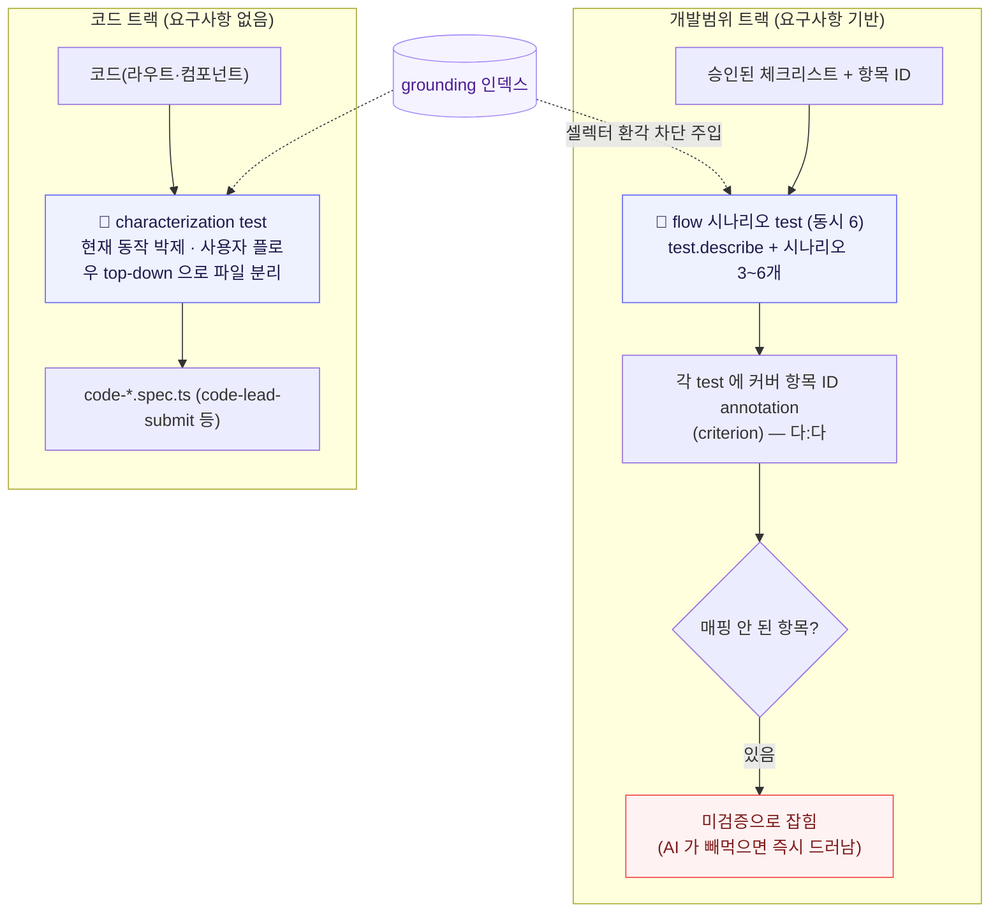

### 개발범위 트랙 (요구사항 기반)
승인된 체크리스트 → Playwright spec (동시 6개). **항목별 파편 테스트가 아니라 흐름(flow) 단위 시나리오**로 만든다(`test.describe` + 시나리오 test 3~6개).

- 체크리스트 내용·항목 ID 를 프롬프트에 직접 주입(AI 가 다시 Read 안 함).
- **각 test 가 커버하는 항목 ID 를 annotation 으로 선언** → 항목↔테스트 연결(다:다):
  ```ts
  test('정상 상담 신청 → 완료', {
    annotation: [{ type: 'criterion', description: 'login-01' }]
  }, async ({ page }) => { ... })
  ```
- 매핑 안 된 항목 = **미검증**으로 잡힘 → AI 가 항목을 빼먹으면 즉시 드러남.

### 코드 트랙 (코드 기반)
요구사항 없이 코드에서 **characterization(현재 동작 박제) 테스트**를 만든다(`code-*.spec.ts`). **사용자 플로우를 top-down 으로 잡아** 파일을 나눈다(예: `code-lead-submit`, `code-modal-lifecycle`) — 콜그래프 정적 분석이 아니라 AI 가 "이건 상담 제출 기능"이라고 판단하고 그 흐름이 타는 코드 경로를 따라감.

## 4. grounding 인덱스 — ⚖️ AI 없음

소스에서 **실존하는** `data-testid` / `aria-label` / 라우트를 정규식으로 추출해 `.qa/index/index.json` 에 저장 → 생성 프롬프트에 주입. **AI 가 없는 셀렉터를 지어내는 환각을 차단**한다.

## 5. 실행 & 검증 — ⚖️ Playwright (결정적)

dev 서버를 구동하고(구동 명령·준비 URL 은 config) Playwright 로 실행 → 통과/실패/스킵. 로그인(auth)이 켜져 있으면 1회 로그인 → 세션(storageState) 재사용. 실패만 재실행, 특정 spec 만 실행도 가능. 리포트는 `--reporter=json` 을 stdout 으로 받아 파싱(공유 파일 없음).

> UI 상 이 페이지("실행 & 검증", 4단계)는 **실행 액션 + 결과(추적성·변경영향) + 품질 도구(self-healing·네거티브·flaky·mutation)**를 한 곳에 합쳤다. 실행하면 아래 추적성 뷰가 즉시 갱신된다. (기존 별도 "추적성" 스텝은 이 페이지로 통합됨)

## 6. self-healing — 🤖 AI(분류) + ⚖️ 실행

실패한 spec 을 파일별로 **동시 4개** 병렬 처리. AI 는 실패를 **분류만** 하고, 통과 판정은 기계가 한다.

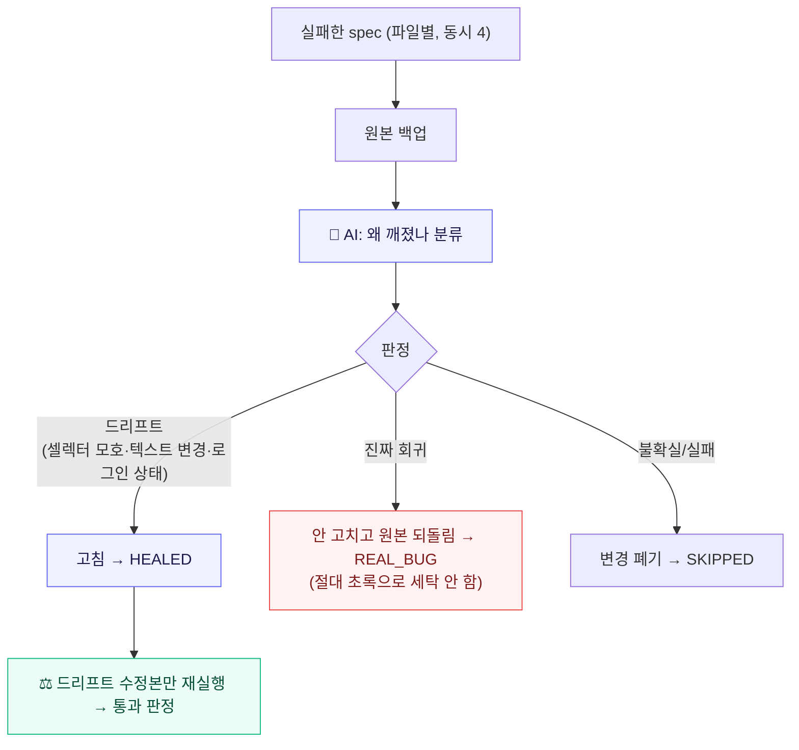

## 7. 네거티브 컨트롤 — ⚖️ AI 없음

**테스트가 진짜 검증하는지**를 확인한다. 통과 테스트의 **기대값을 일부러 틀리게** 바꿔 재실행 → 빨개져야 "진짜 검증", 그대로 통과하면 "알맹이 없는 테스트".

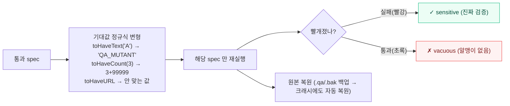

- 파일마다 독립이라 **동시 4개** 병렬. 각 파일은 변형 전 `.qa/.bak` 에 원본 백업 → 프로세스가 죽어도 다음 실행 시작 때 자동 복원(side-effect 0).

## 8. flaky(불안정) 감지 — ⚖️ AI 없음

**같은 코드로 N회 반복 실행** → 통과/실패가 **섞이는** 테스트를 색출. "결정적 판정"이라는 전제를 지키는 신뢰 점검.

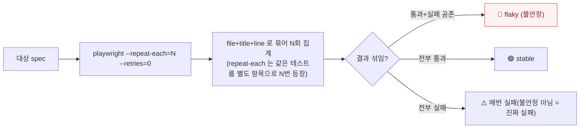

## 9. mutation score — ⚖️ AI 없음 ⭐

**스위트가 진짜 결함을 잡는지**를 잰다. 소스 로직에 작은 결함(mutant)을 심고, 스위트가 그걸 잡는 비율 = mutation score. **커버리지("밟았나")보다 결함검출력을 잘 예측**한다. 살아남은 mutant = 아무 테스트도 못 잡는 **검증 구멍**.

> 비유: 화재경보기(테스트)가 진짜 작동하는지 보려고 **일부러 연기를 피운다**(결함을 심는다). 안 울리는 경보기 = 있으나 마나.

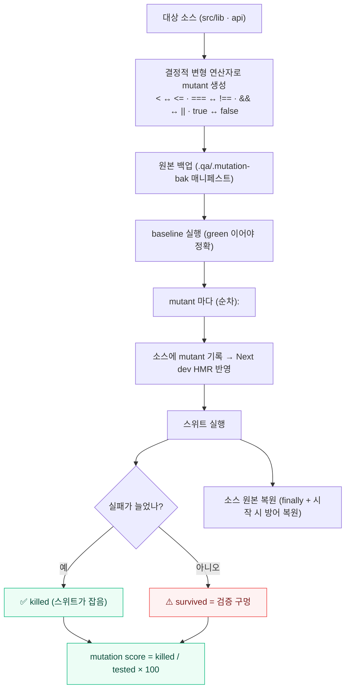

- **mutant 는 서로 같은 파일을 건드릴 수 있어 순차 실행**. 재빌드 없이 Next dev HMR 로 반영.
- 유저의 **실제 소스**를 임시 변형하므로, 원본을 매니페스트로 백업하고 `finally` + 다음 실행 시작 시 방어 복원 → 크래시에도 원상복구 보장.
- 대상은 JSX 오염을 피해 로직 파일(`src/lib`, `api`)만. 공백으로 감싼 비교(` < `)만 변형해 제네릭/JSX 를 안 건드림.

## 10. 단언 강도 분석 — ⚖️ AI 없음 (정적)

각 `test` 블록의 `expect(...).matcher()` 를 **텍스트로 읽어**(실행 X, 토큰 0) matcher 종류로 등급을 매긴다.

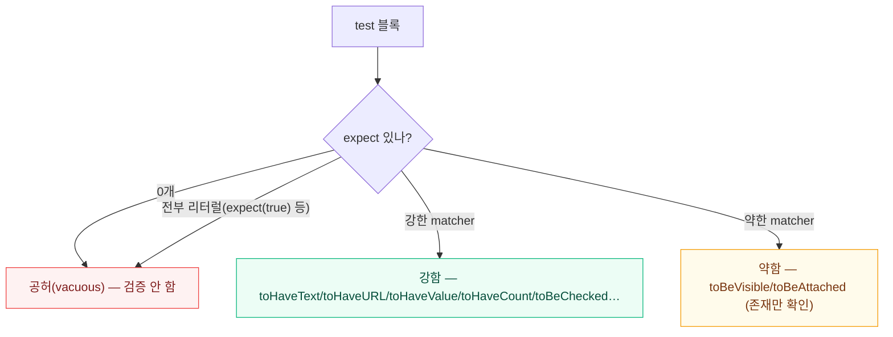

점수 `강한단언% = 강함 ÷ (전체 − 스킵) × 100`. 약함/공허를 강한 값 단언으로 다시 쓰는 **강화 루프**(AI)도 있다(거짓 통과 방지 가드 포함).

## 11. 셀렉터 검증 — ⚖️ AI 없음 (정적)

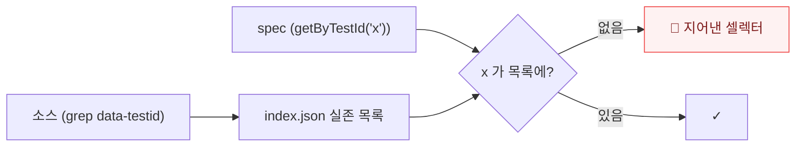

`getByTestId` 만 검사(getByRole·텍스트 셀렉터 제외). testid 기반일수록 효과적.

## 12. 생성 채점 — ⚖️ AI 없음

프롬프트·규칙을 바꿔 재생성했을 때 생성 품질(단언 강도 기반)이 오르는지 점수로 추적(`.qa/evals/history.json`).

## 13. 코드 커버리지 — ⚖️ nextcov (V8)

**생성한 테스트가 코드 라인 몇 %를 실제로 실행하는지** 측정. Turbopack 호환(V8 기반).

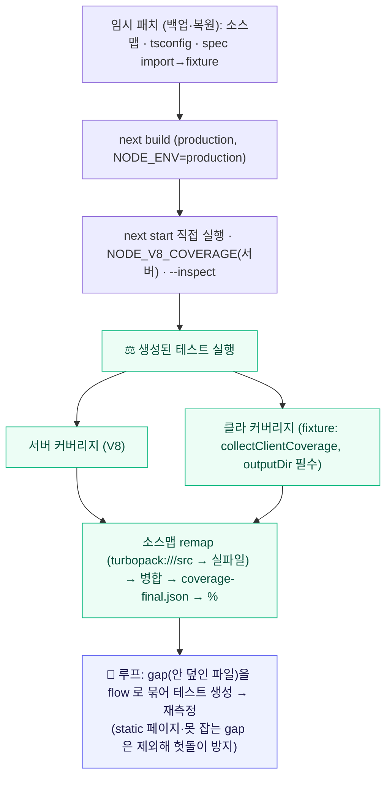

- ⚠️ **클라 수집 함정:** `collectClientCoverage` 는 `config.outputDir` 를 안 넘기면 저장을 통째로 스킵한다. fixture 는 반드시 config 의 `outputDir` 와 같은 값을 넘겨야 컴포넌트가 잡힌다.
- **E2E 커버리지는 천장이 낮다**(static prerender 페이지·서버 컴포넌트는 요청 때 실행 안 됨). 커버리지 %는 목표가 아니라 참고 지도로 쓰고, 진짜 품질은 흐름 통과·단언 강도·mutation score 로 본다.

## 14. 추적성 (Traceability) — ⚖️ AI 없음 ⭐

**"요구사항의 각 합격기준이 검증됐나 / 뭐가 비었나 / 어느 게 실패인가"**를 **파일 단위가 아니라 항목 단위**로 답한다. 새로 수집하지 않고 기존 `.qa` 산출물을 조인만 한다.

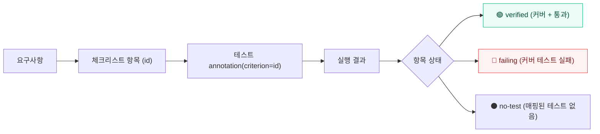

- **개발범위 트랙**: 체크리스트별 카드 → 항목마다 상태·기법태그·커버 테스트. "3개 중 2개 검증, 1개 실패, 0개 미검증".
- **코드 트랙**: 합격기준이 없으므로 **테스트 단위**로 펼침(파일별 test 하나하나의 통과/실패). → "code-consultation 파일 실패"가 아니라 "빈 폼 검증 테스트가 실패"까지 콕 집음.
- 추적성 뷰는 **실행 & 검증** 페이지(4단계) 안에 주 결과 뷰로 들어있다(실행하면 바로 갱신).

### 변경 영향 분석 (TIA) — 재테스트 필수 표시 · ⚖️ AI 없음

고객사 수정처럼 **소스를 고치면**, 마지막 실행 이후 **내용이 바뀐 파일**을 감지해 그 파일을 커버하는 테스트를 **"⚠ 재테스트 필수"**로 표시한다. git 불필요(내용 해시 기반).

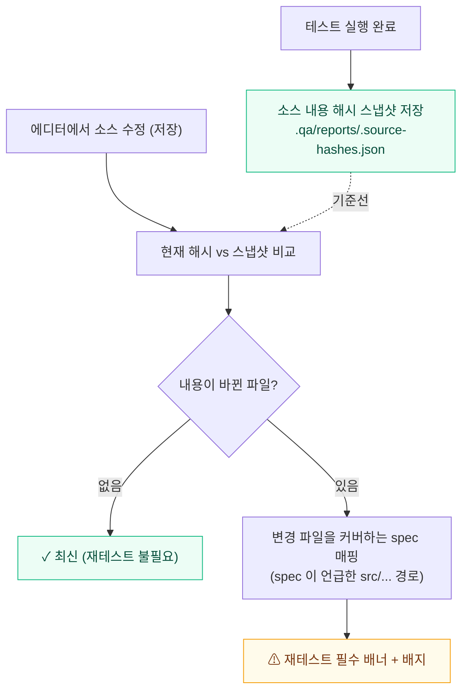

- **내용 해시** 기반이라 mtime 만 바뀐 건(도구가 rewrite·touch) 무시 → 진짜 편집만 잡힘.
- 매핑은 "spec 이 언급/선언한 소스 경로" 기준(코드 트랙 헤더의 `// 덮는 코드:` 등). 언급 안 된 실행 커버까지 잡으려면 per-test 커버리지 필요(향후).

## 15. 구현 감사 / 요구사항 테스트 커버리지 — 🤖 AI

브라우저 없이 빠르게: 요구사항 각 항목이 **구현됐나**(코드 근거 매핑, 완료율%), **테스트로 검증되나**(요구사항 ↔ spec 매핑).

## 16. 로그인(auth) — ⚖️ AI 없음 + 🤖 셋업 생성

비밀번호는 Electron `safeStorage` 로 암호화해 `.qa/.auth/` 에 저장(gitignore). `auth.setup.ts` 로 1회 로그인 → 세션 저장 → 이후 재사용. 셋업 스크립트는 로그인 페이지를 읽어 AI 가 생성.

---

## .qa 폴더 레이아웃

```
.qa/
├─ config.json
├─ rules/*.md            # 단계별 가드레일 (scope: all|checklist|tests|auth|healing)
├─ requirements/*        # 업로드 요구사항
├─ intent/*.md           # /qa-capture 의도 원장
├─ checklists/*.md       # 체크리스트 (frontmatter + Given/When/Then + 기법 태그)
├─ tests/*.spec.ts       # 생성된 Playwright 테스트 (+ auth.setup.ts)
├─ index/index.json      # grounding 인덱스 (실존 testid/aria/route)
├─ evals/history.json    # 생성 채점 이력
├─ coverage/             # nextcov 하니스·리포트 (fixtures.ts 포함)
├─ reports/              # 실행/감사/커버리지 리포트 (last.json 등)
├─ .auth/                # 암호화 비번·세션 (gitignore)
├─ .bak/                 # 네거티브 컨트롤 변형 백업 (crash-safe, gitignore)
├─ .mutation-bak/        # mutation 소스 백업 (crash-safe, gitignore)
└─ playwright.config.ts  # 툴이 생성·관리 (env 주입식, CJS/ESM 호환)
```

`.qa/` 는 대상 프로젝트 안에 생성되어 git 에 함께 커밋된다 → "무엇이 바뀌었는지"가 코드 diff 로 추적된다.

## 대상 프로젝트 설정 (.qa/config.json)

| 키 | 의미 | 예시 |
|---|---|---|
| `devCommand` | dev 서버 실행 명령 | `npm run dev` |
| `readyUrl` | 준비 폴링 URL | `http://localhost:3000` |
| `baseURL` | 테스트 baseURL | `http://localhost:3000` |
| `readyTimeoutMs` | 준비 대기 한도 | `60000` |
| `maxFailures` | 실패 N개 시 즉시 중단(0=끝까지) | `0` |
| `auth` | (선택) 로그인 | `{ enabled, loginUrl, user }` (비번은 암호화 별도 저장) |

## 개발 / 실행

```bash
npm install
npm run dev          # Electron 개발 모드 (--watch: main/preload 변경 자동 재빌드)
npm run typecheck    # main + renderer
npm run build        # out/
```

> 최초 설치 후 `Error: Electron uninstall` 이 나면: `node node_modules/electron/install.js`

### AI 인증 / 과금
`claude -p` 를 **구독 인증**으로 호출(환경의 `ANTHROPIC_API_KEY` 를 제거해 API 과금 회피). 출력은 `--output-format stream-json` 으로 진행 상황을 실시간 스트리밍.

---

## 구조

```
src/
├─ shared/types.ts             # IPC API + 데이터 타입 (단일 계약)
├─ main/
│  ├─ index.ts / ipc.ts
│  └─ lib/
│     ├─ claudeRunner.ts       # claude -p spawn (stream-json)
│     ├─ prompts.ts            # 분해/체크리스트/테스트/감사/치유 프롬프트
│     ├─ rules.ts              # 단계별 규칙 합성
│     ├─ projectManager.ts     # .qa 관리·체크리스트(+항목 파서)·감사·단언강도·생성채점
│     ├─ codeIndex.ts          # grounding 인덱스·셀렉터 검증
│     ├─ devServer.ts / playwrightRunner.ts / runner.ts  # 실행·치유·네거티브컨트롤·flaky·mutation
│     ├─ mutation.ts           # mutation 연산자·소스 백업/복원 (순수)
│     ├─ traceability.ts       # 요구사항↔항목↔테스트↔결과 조인
│     ├─ auth.ts               # safeStorage 비번·세션
│     ├─ codeCoverage.ts       # nextcov 코드 커버리지 오케스트레이션
│     ├─ dotenv.ts             # 대상 프로젝트 .env 로드
│     └─ appSettings.ts        # 최근 프로젝트
├─ preload/index.ts            # window.api
└─ renderer/src/               # React 19 + Tailwind v4 + Zustand · Vercel/Geist 스타일
```

## 완성도 / 남은 후속

- ✅ 항목 단위 추적성 · mutation score · flaky · 네거티브 컨트롤 · 코드 커버리지(서버+클라) · **변경 영향(TIA) 재테스트 표시** · 요구사항 상세/수정/삭제
- ⬜ 항목별 **승인/분류 상태**(자동화가능/수동/시드필요/제외)
- ⬜ mutation-guided 생성(살아남은 mutant → AI 가 잡는 테스트 생성, Meta ACH 식)
- ⬜ **CI 게이트**(헤드리스 러너 + GitHub Action, PR마다 실행)
- ⬜ TIA 정밀도 ↑(per-test 커버리지 기반 매핑) · 비주얼/스냅샷 회귀 · 비-Next 스택 대응
