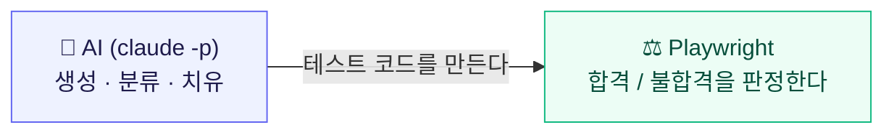
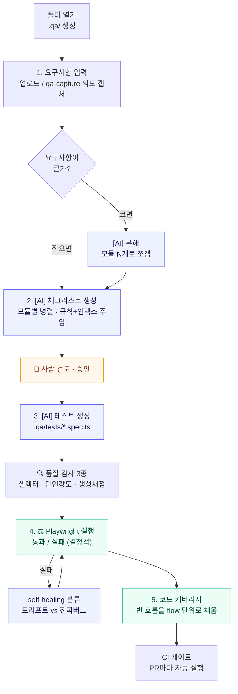
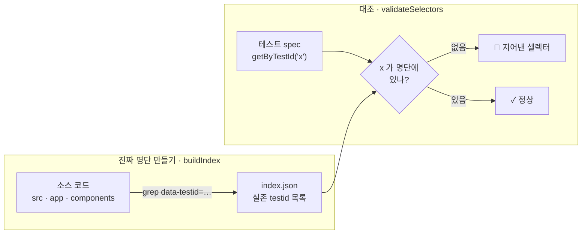
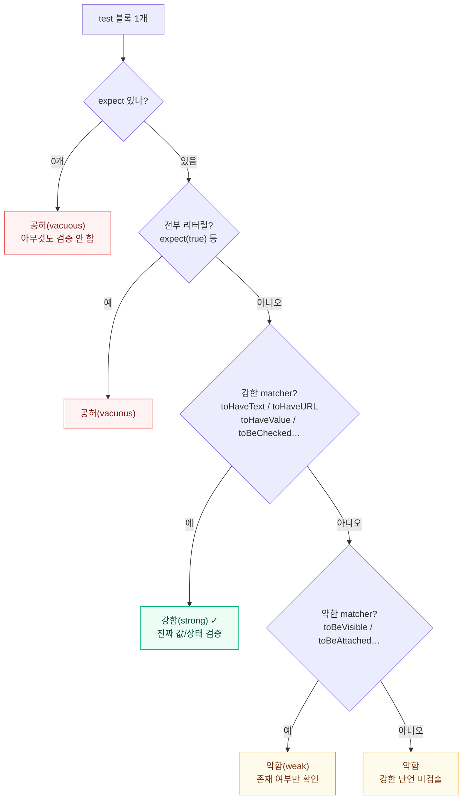
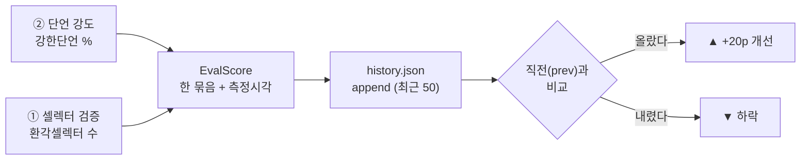

# Auto QA

사내 QA 자동화 데스크톱 툴 (Electron). 프로젝트 폴더를 연결하고, **요구사항/개발 의도**를 소스로 두 가지 QA를 돌린다:

1. **흐름 QA (E2E)** — 요구사항 → AI 분해 → 체크리스트 → AI Playwright 테스트 → 결정적 실행 → self-healing
2. **구현/커버리지 감사** — 요구사항이 구현됐나 · 테스트로 검증되나 · 코드 라인 커버리지

**설계 원칙**: AI 는 "탐색·생성·치유"만. 합격/실패 **판정은 결정적(Playwright assertion)** 에 맡긴다. (AI 매번 판단 ❌ → 토큰·신뢰 손해)



> AI 한테 "이거 통과야?"를 매번 물으면 비싸고 답이 들쭉날쭉하다. 그래서 **AI 는 코드만 생성**하고, 실제 통과 여부는 **기계(Playwright)가 결정적으로** 판단한다.

---

## 핵심 기능

| 기능 | 설명 |
|---|---|
| 요구사항 입력 | 파일 업로드(md/txt/pdf/이미지) · 직접 붙여넣기 · `/qa-capture` 의도 원장 |
| **자동 분해** | 거대 요구사항 1개 → AI 가 테스트 모듈 N개로 분해 → 모듈별 체크리스트(병렬) |
| 체크리스트 | Given/When/Then 합격기준. 검토·편집·승인 (전체 승인 일괄 버튼) |
| 테스트 생성 | 승인된 체크리스트 → Playwright spec. 전체 생성(병렬)·단일 재생성 |
| **품질 검사 3종** | 셀렉터 검증(환각 탐지) · 단언 강도 분석 · 생성 채점(이력). 정적·토큰 0 ([아래](#품질-검사-3종-정적-분석)) |
| **grounding 인덱스** | 소스의 진짜 testid/aria/route 를 추출해 생성 프롬프트에 주입 → AI 환각 차단 |
| 실행 | dev 서버 구동 → Playwright 결정적 실행 → 통과/실패/스킵 리포트 (단일 spec 실행 가능) |
| **네거티브 컨트롤** | 기댓값을 일부러 틀리게 변형 → 빨개지는지 확인 (안 빨개지면 가짜 테스트) |
| **CI 게이트** | `.qa/ci/run.mjs` + GitHub Action 자동 생성 → PR마다 헤드리스 실행 |
| **로그인(auth)** | 비번 safeStorage 암호화 · 1회 로그인 후 세션 재사용 · 실패 시 나머지 skip |
| **self-healing** | 깨진 실패를 AI 가 *드리프트(고침) vs 진짜버그(REAL_BUG)* 로 **분류**만. 무작정 초록 ❌ |
| **가드레일 규칙** | `.qa/rules/*` 단계별로 쪼갠 규칙을 해당 AI 단계에만 주입 (무신사식) |
| **변경 감지** | 요구사항/체크리스트가 더 최신이면 "변경됨" 배지 → 해당 flow 만 재생성 |
| **구현 감사** | 요구사항 항목별 구현/부분/미구현 + 코드 근거 → 완료율 % |
| **요구사항 테스트 커버리지** | 요구사항 항목 중 몇 %가 테스트로 검증되나 |
| **코드 커버리지** | 서버+클라 실제 라인 커버리지 (nextcov V8, production 빌드) |
| 프로젝트 기억 | 마지막/최근 프로젝트 자동 재연결 |

---

## 두 가지 "QA" / 세 가지 "커버리지"

- **흐름 QA (E2E)**: "제대로 도나?" — Playwright 로 사용자 시나리오 실행.
- **구현 감사**: "다 만들었나?" — AI 가 요구사항 ↔ 코드 매핑. 완료율 %. (브라우저 불필요, 빠름)
- **요구사항 테스트 커버리지**: "요구사항이 테스트로 검증되나?" — AI 가 요구사항 ↔ spec 매핑.
- **코드 커버리지**: "테스트가 코드 라인 몇 %를 실행하나?" — nextcov(V8) 실제 계측. (무거움)

---

## 동작 파이프라인 (흐름 QA)

화면 왼쪽 5단계: `요구사항 → 체크리스트 → 테스트 → 실행 → 커버리지`.



`.qa/` 는 대상 프로젝트 안에 생성되어 git 에 함께 커밋된다 → "무엇이 바뀌었는지"가 코드 diff 로 추적된다.

---

## 품질 검사 3종 (정적 분석)

테스트를 만든 뒤, **AI 도 안 쓰고 실행도 안 하고** `.qa/tests/*.spec.ts` 를 텍스트로 읽어 정규식으로 검사한다. → 수십 ms, 토큰 0, 항상 같은 결과(결정적). 화면 3단계(테스트)의 버튼.

### ① 셀렉터 검증 — "있는 버튼을 가리키나"

테스트가 가리키는 `data-testid` 가 **진짜 코드에 존재하는지** 명단과 대조해 AI 환각을 잡는다. (`codeIndex.ts`)



예: 코드엔 `submit-order` 만 있는데 AI 가 `getByTestId('order-submit')` 로 썼다 → 명단에 없음 → 빨간 플래그.
한계: `getByTestId` 만 검사한다(`getByRole`·텍스트 셀렉터는 제외). testid 기반일수록 효과적.

### ② 단언 강도 분석 — "제대로 검사하나"

각 `test` 블록의 `expect(...).matcher()` 에서 **matcher 종류**를 보고 강/약/공허로 등급을 매긴다. (`projectManager.ts` `scoreTest`)



판정은 **위에서부터 순서대로** (공허 → 강함 → 약함). 점수 `강한단언% = 강함 ÷ (전체 − 스킵) × 100`.
왜 중요? `toBeVisible()`(약함)은 "뭔가 떴다"만 본다. "환영합니다 홍길동"이 *맞게* 떴는지는 `toHaveText(...)`(강함)라야 잡힌다. → **커버리지 %보다 진짜 품질 지표** (밟았나 vs 밟고 제대로 확인했나).

### ③ 생성 채점 — "프롬프트/규칙을 바꿨더니 좋아졌나"

①·②를 한 점수로 묶고 `.qa/evals/history.json` 에 누적 → **직전과 비교**해 추세를 본다. (`projectManager.ts` `runEval`)



혼자선 의미 없고 **변경 전후 비교용**이다. 규칙을 고치고 다시 생성→채점해서 점수가 오르면 "그 변경은 효과 있었다"를 **감이 아니라 숫자로** 판단한다.

| 검사 | 무엇을 보나 | 방법 | 결과 |
|---|---|---|---|
| 셀렉터 검증 | 진짜 버튼 가리키나 | testid 명단 대조 | 환각 셀렉터 목록 |
| 단언 강도 | 제대로 검사하나 | matcher 패턴 등급 | 강/약/공허 % |
| 생성 채점 | 추세가 좋아지나 | 위 둘 묶어 이력 | 점수 + ▲/▼ delta |

---

## AI 인증 / 과금

- 내부적으로 **`claude -p`(Claude Code CLI)를 child_process 로 spawn**.
- `ANTHROPIC_API_KEY` 를 자식 env 에서 제거(`scrubApiKey`) → **`claude login` 구독 인증 강제**, 별도 API 종량과금 없음.
- 전제: 이 머신에 Claude Code 설치 + `claude login` 완료.

---

## 의도 캡처 스킬 (`/qa-capture`)

개발 중 채팅에 흩어진 비즈니스 규칙·조건·예외를 테스트 소스로 보존한다.

- **수동**: Claude Code 에서 `/qa-capture <flow>` → `.qa/intent/<flow>.md` 에 병합 누적 (OPEN/CONFLICT 표시, 출처 보존)
- **가끔 자동**: Stop 훅(`~/.claude/hooks/qa-nudge.sh`)이 `.qa/` 프로젝트에서 N턴마다 백그라운드로 `.qa/intent/_inbox.md` 에 의도 추출
- auto-qa 는 `.qa/intent/*` 를 요구사항과 동일하게 읽는다 → 개발 의도가 곧 테스트 기준

설치 위치: `~/.claude/skills/qa-capture/SKILL.md`, 훅: `~/.claude/settings.json` 의 `hooks.Stop`.

---

## 코드 커버리지 (무거운 별도 모드)

서버+클라 실제 라인 커버리지를 [nextcov](https://github.com/stevez/nextcov)(V8 기반, Turbopack 호환)로 측정.

**네가 생성한 테스트(`.qa/tests/*.spec.ts`)를 실제로 실행**해서, 그 테스트가 코드 라인 몇 %를 덮는지 측정한다. (= "내 테스트의 코드 커버리지")

동작 (자동, 임시 패치는 백업·복원):
1. 타겟에 `nextcov`/`@playwright/test` 없으면 설치
2. `.qa/coverage/` 에 nextcov 하니스 생성 (testDir → `.qa/tests`)
3. `next.config`(소스맵) + `tsconfig`(.qa 빌드 제외) 임시 패치
4. `next build` → `next start`(NODE_V8_COVERAGE + `--inspect`) — **next 를 직접 실행**(npm 래퍼 X)
5. 생성된 테스트 실행 → 서버(NODE_V8) + 클라(CDP) 수집 → 소스맵 remap → `coverage-final.json` → %
6. 패치 복원

> 커버리지가 낮으면 = **테스트가 아직 부족**하다는 정직한 신호 (모듈을 더 생성하고 auth/시드를 붙이면 올라감).
> 제약: production 빌드라 수 분 소요. 서버 커버리지는 안정적, 클라이언트(브라우저) 수집은 보강 예정. 타겟 `next.config`/`tsconfig` 를 잠깐 수정(자동 복원)한다.

---

## 개발 / 실행

```bash
npm install
npm run dev          # Electron 개발 모드
npm run typecheck    # main + renderer
npm run build        # out/
```

> 최초 설치 후 `Error: Electron uninstall` 이 나면: `node node_modules/electron/install.js`

---

## 대상 프로젝트 설정 (.qa/config.json)

| 키 | 의미 | 예시 |
|---|---|---|
| `devCommand` | dev 서버 실행 명령 | `npm run dev` |
| `readyUrl` | 준비 폴링 URL | `http://localhost:3000` |
| `baseURL` | 테스트 baseURL | `http://localhost:3000` |
| `readyTimeoutMs` | 준비 대기 한도 | `60000` |
| `maxFailures` | 실패 N개 시 즉시 중단(0=끝까지) | `0` |
| `auth` | (선택) 로그인 | `{ enabled, loginUrl, user }` (비번은 암호화 별도 저장) |

---

## .qa 폴더 레이아웃

```
.qa/
├─ config.json
├─ rules/*.md            # 단계별 가드레일 (scope: all|checklist|tests|auth|healing)
├─ requirements/*        # 업로드 요구사항
├─ intent/*.md           # /qa-capture 의도 원장
├─ checklists/*.md       # 모듈별 체크리스트 (frontmatter + Given/When/Then)
├─ tests/*.spec.ts       # 생성된 Playwright 테스트 (+ auth.setup.ts)
├─ index/index.json      # grounding 인덱스 (실존 testid/aria/route)
├─ evals/history.json    # 생성 채점 이력
├─ ci/run.mjs            # 헤드리스 CI 러너 (GitHub Action 이 호출)
├─ coverage/             # 코드 커버리지 하니스·리포트
├─ reports/              # 실행/감사/커버리지 리포트
├─ .auth/                # 암호화 비번·세션 (gitignore)
└─ playwright.config.ts  # 툴이 생성·관리 (env 주입식, CJS/ESM 호환)
```

---

## 구조

```
src/
├─ shared/types.ts             # IPC API + 데이터 타입 (단일 계약)
├─ main/
│  ├─ index.ts / ipc.ts
│  └─ lib/
│     ├─ claudeRunner.ts       # claude -p spawn (stream-json)
│     ├─ prompts.ts            # 분해/체크리스트/테스트/감사/치유 프롬프트
│     ├─ rules.ts              # 단계별 규칙 합성
│     ├─ projectManager.ts     # .qa 관리·체크리스트·감사·단언강도·생성채점
│     ├─ codeIndex.ts          # grounding 인덱스·셀렉터 검증
│     ├─ devServer.ts / playwrightRunner.ts / runner.ts  # 실행·치유·네거티브컨트롤
│     ├─ auth.ts               # safeStorage 비번·세션
│     ├─ codeCoverage.ts       # nextcov 코드 커버리지 오케스트레이션
│     ├─ ciScaffold.ts         # CI 러너·GitHub Action 생성
│     └─ appSettings.ts        # 최근 프로젝트
├─ preload/index.ts            # window.api
└─ renderer/src/               # React 19 + Tailwind v4 + Zustand
```

---

## 남은 후속

- 코드 커버리지: 클라이언트(브라우저) 수집 보강, 비-Next 스택 대응
- 거대 요구사항 감사 병렬 분해
- 스냅샷/비주얼 회귀
- 셀렉터 검증: `getByRole`·텍스트 셀렉터까지 대조 확장
